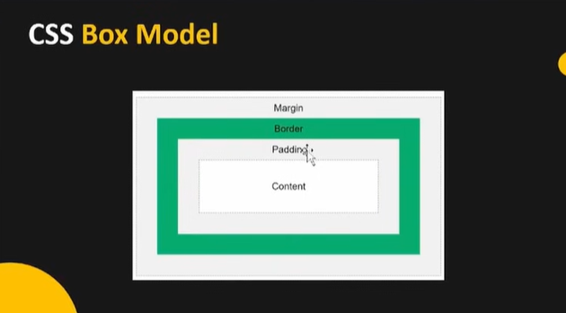

# what is css?
- CSS is used to style and design web pages by controlling colors, fonts, layout, and spacing.

# There are three types of CSS:
 - inline css
 - internal css
 - external css

 ## e.g of inline css:
    - <h1 style="color: black; background-color: red;  ">Apple</h1> --> cause the styling is done in a single line.

 ## e.g of internal css:

    

    <h1>heading</h1>
    
paragraph

  - here instead of single line css is added using style tag in the same html file as separate block .

  ## External CSS:
  - here css is written in separate file to improve maintainability, reusability and performance.
  - external css is best for real-time projects.
  

  # internal and inline css example code :
    
   

   <h1 style="color: white;">Error Makes Clever</h1>
   
paragraph 

   

   # External CSS example code :
     - create a seperate css file called style.css and link the html code with it.

     ## code
     main.html code:
      <link rel="stylesheet" href="style.css">
      <h1>hello bro!</h1>
     
     style.css code:
        h1{
         color: red;
         background-color: azure;
          }

## CSS SELECTORS

# Universal Selector (*)
- Selects all elements
code:
* {
  margin: 0;
  padding: 0;
}

# Element / Tag Selector
 - Selects elements by tag name
code:
 p {
  color: red;
}

# Class Selector (.)
- Reusable selector
- Can be used multiple times
code:
.box {
  border: 1px solid black;
}

## ID Selector (#)
-Unique selector
-Used only once
#header {
  background: blue;
}

# Group Selector
- Apply same style to multiple selectors
code:
h1, h2, p {
  font-family: Arial;
}

## Descendant Selector (SPACE)
- Selects all elements inside another (any depth)
- Meaning: all p inside div (child or grandchild)
code:
div p {
  color: red;
}

## Child Selector (>)
-Selects only direct children
-Does NOT select grandchildren
code:
div > p {
  color: blue;
}

## Attribute Selector
-Selects elements based on attributes
code:
input[type="text"] {
  border: 1px solid black;
}

## Pseudo-classes (:)
-Select elements based on state
-Common pseudo-classes:

:hover
:focus
:active
:nth-child(n)

button:hover {
  background: black;
}

li:nth-child(2) {
  color: red;
}

## Pseudo-elements (::)

-Select parts of an element
-content is mandatory for ::before and ::after
-code: 
p::first-letter {
  font-size: 30px;
}

div::before {
  content: "★";
}

### State vs Element (Interview Concept)
## State (:)

- Condition of an element
- Examples:
  - hover
  - focus
 - active

button:hover { }

## Element Part (::)

- Specific part of an element

- Examples:

   - first-letter
   - before
   - after

p::after { }

## CSS Specificity (High → Low)

Inline style > ID > Class > Element
code:
p { color: red; }
.text { color: blue; }
#para { color: green; }

- Final color: green

## !important

- Overrides all specificity
- Not recommended in real projects

p {
  color: red !important;
}

## CSS BOX MODEL
 

 - Every HTML element is basically a box.
 - That box has 4 layers, from inside → outside

 # 1.Content:
  - This is the actual stuff inside the element
  - Text, image, video, whatever you put.
   Code:
   - width: 200px;
   - height: 100px;
  - This applies only to content, not padding or border (important for interviews 👀).

# 2.. Padding

- Space inside the element, between content and border.
- Increases the inner breathing space
- Background color extends into padding
- Padding adds to the element’s total size
code:
 padding: 20px;

 # 3.3. Border

- The boundary line around padding + content.
- Can have width, style, and color
- Adds to total size
Code:
 border: 2px solid black;
- This is the outline of the box, not just decoration.

you have determine width :2px (eg), color:red(eg) and style : (eg)Solid in order to make boder visible.

# 4.Margin

- Space outside the element, between this element and others.
- Creates distance between elements
- Background color does NOT affect margin
- Margins can collapse (top & bottom margins combine 👀)
code:
margin: 30px;
- Think: personal space, don’t touch me.

# Order:
Content → Padding → Border → Margin

! IMPORTANT

### box-sizing (Quick Notes)
- What is box-sizing?
    - Controls how width and height of an element are calculated.

## Default value
   box-sizing: content-box;
 - Width = content only
 - Padding and border are added outside
 - Can increase actual size and break layout

## border-box (recommended)
box-sizing: border-box;
  - Width = content + padding + border
  - Total size stays fixed
  - Content shrinks automatically
  - Prevents overflow and layout issues

## Why border-box is preferred

   - Predictable element size
   - Easier responsive layouts
   - Used in real-world projects

## Common global usage
* {
  box-sizing: border-box;
}

# Interview one-liner
  - content-box → width applies only to content
  - border-box → width includes padding and border

  # eg code

  

<h1>Hello!!</h1>

- Just like we are using center tag in html use text-align in css

!!VERY IMP CONCEPT:
# DISPLAY PROPERTY:

# 1. display: block
- Starts on a new line
- Takes full width by default
- Width & height ✅ allowed
Examples:
- div, p, h1
- display: block;

# 2.display: inline

- Stays in the same line
- Takes only required width
- Width & height ❌ not allowed
- Padding works left/right only (top/bottom weird)
Examples:
span, a, strong

# 3.display: inline-block ⭐ VERY IMPORTANT

- Stays in the same line
- Width & height ✅ allowed
- Padding & margin work properly
- display: inline-block;
Used for:
- Buttons
- Navbar items
- Cards side-by-side
- Best of block + inline 🧠✨

# 4.display: none

- Element is removed completely
- Takes no space
- Not visible, not clickable
- display: none;

