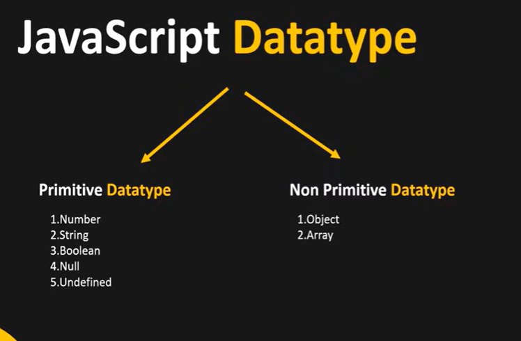
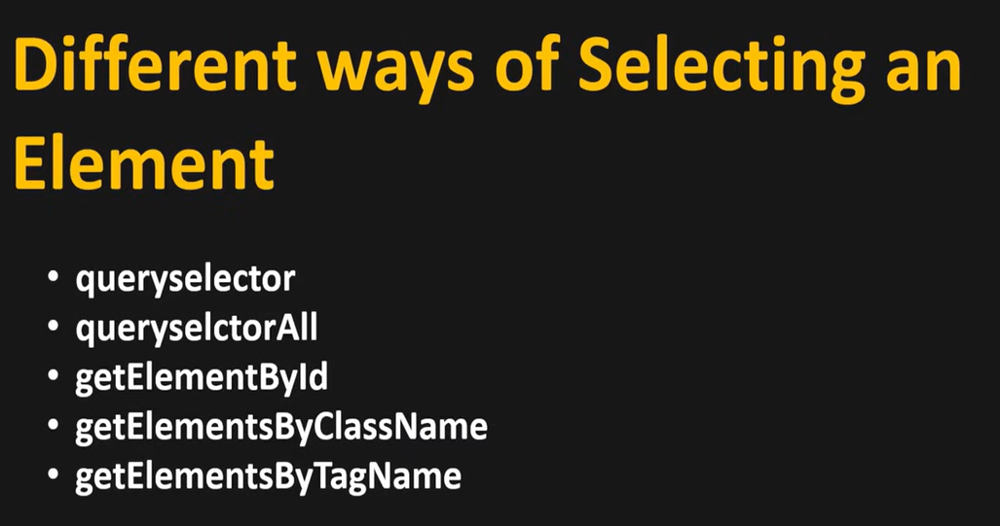
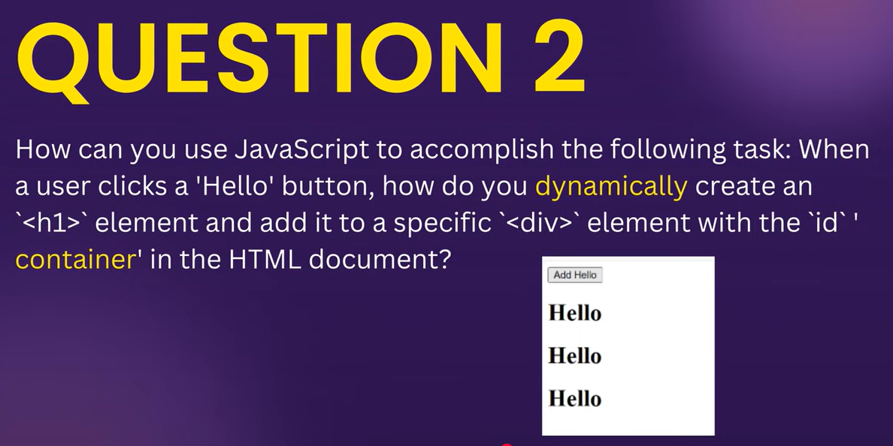
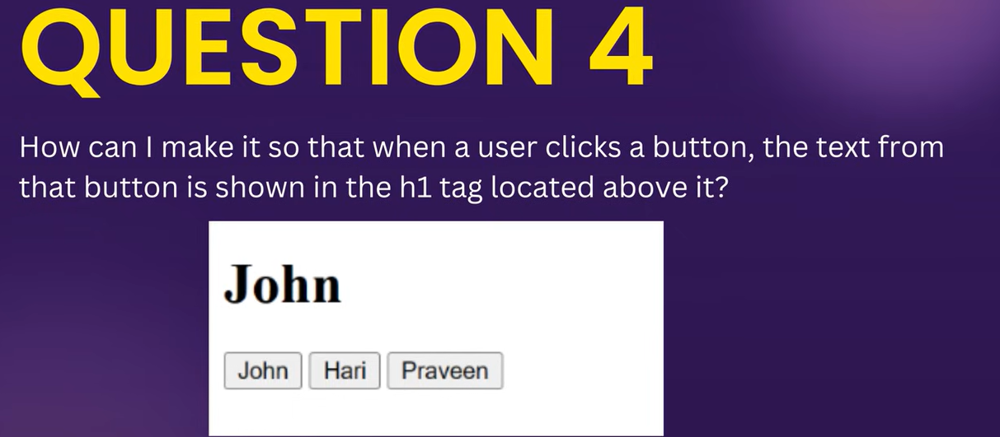

# What is JAVASCRPT?
  -JavaScript is a high-level, interpreted, dynamically typed programming language used to create interactive and dynamic web pages. It runs in the browser and can also run on servers using environments like Node.js.

# VARIABLES:
 - A variable is a named storage in memory that holds data which can be changed during program execution. It acts as a container for values like numbers, strings, or objects.

   var a=10  ---> variable declaration!
   var b=20
   console.log(a+b) --> prints 30

   # three are three types of declaring a variable
     -  var
     -  let
     -  const
     
#  var (global scope)

- Scope: Function-scoped. Accessible anywhere inside the function where declared.
- Re-declaration: Can re-declare in the same scope.
- Update: Can be updated.
- Hoisting: Hoisted and initialized as undefined
        
# let
 
 - scope: block scoped ({ accessible only inside this block})
 - cannot be re-declared but can be updated 
 - hoisted but in temporal dead zone(tdz means the period between the start of the block and the moment let or const variable is declared (not for var only let and const)during which the variable exists but cannot be accessed.)

# const
  - block scoped
  - cannot be updated or redeclared
  - hoisted but in tdz

- strings should be given inside "(string)"
- if u declare var a =apple it will think inside a variable "a" there is aother varaible called "apple" and check inside it for value.

# keywords:
- predefined words which cant be used as varaible !
e.g let, const, if ,switch etc

#commments 

// -->single line comment
/* */ multiline comment

# Datatypes

- JS is dynamically typed language which declares the type of a variable during runtime.
- 

# js function

code: 
 function greet()
{
    console.log("hi!")
}
greet();

### JAVASCRIPT DOM(DOCUMENT OBJECT MODEL)MANIPULATION

- DOM manipulation means using JavaScript to change what you see on a webpage without reloading the page.
- DOM means the HTML code of a webpage is represented as a tree structure in the browser’s memory.

# Event:
- An event is any action performed by the user or browser, like a click, key press, or page load. eg : clciking a button ,hovering mouse.

# EVENT HANDLER
- An event handler is a function that runs when an event occurs

e.g code
<input type="text" id="num1">
<input type="text" id="num2">
<button onclick="add()">ADD</button>

    Result:

# Math Random
let b=Math.random()
---> this generates a number between 0 to 1
we  multiply it by 10 to give a num between 0 and 9 in double
and we use Math.floor to only get the first value.

e.g code 

let b=Math.random()*10
console.log(b)
let c=Math.floor(b)
console.log(c)

# Now lets do a guess a number game!

<h1>Guess the number!</h1>
<input id="input">
<button onclick="check()">check</button>

result:

# Now let's see how to manipulate css using js

## example code

<button onclick="changecolor()">Change Color</button>

GO THROUGH ON HOW TO USE 

## Task 1: WHENVER YOU TYPE SMTHG ON INPUT BOX IT SHOULD APPEAR BELOW ONSPOT WITHOUT REFRESHING AUTOMATICALLY

<input id="input" onkeyup="clickk()">
<h1 id="result">Result</h1>

# onkeyup is used

## Task 2 :

<button onclick="update()">Add</button>

## TASK 3: button on click should change it's(button) color

<button onclick="change()" id="btn">Change color</button>

## TASK 4:

<h1 id="name">name</h1>
<button onclick="namechange(event)">John</button>
<button onclick="namechange(event)">Hari</button>
<button onclick="namechange(event)">Praveen</button>

## Learn the use of innerhtml and how to use it to manipulate the code

## TASK 5:
 <h1 id="res">Hello</h1>
<button onclick="change()">Click</button>

## Task 6:

<input id="input" oninput="wordcount()">
<h1 id="count">Count:</h1>

## Task 7:

<h1>heelloo guys !!!</h1>
<h2>This is my new website!!!</h2>

Lorem ipsum dolor sit amet consectetur adipisicing elit. Quaerat voluptates magni vero doloribus, temporibus incidunt dolorum, a dignissimos autem ratione, repudiandae sit error totam! Repellendus sunt magni reprehenderit ipsam sint!

Lorem ipsum dolor sit amet consectetur adipisicing elit. Sint vero praesentium aliquid. Dolore dolores possimus ipsam omnis magni optio praesentium tempora molestiae repudiandae consequuntur eum inventore nam vero iusto harum, accusantium soluta? Illum minima saepe nam maxime quas nostrum accusantium, culpa, rem, porro natus repudiandae nobis ratione. Quisquam, perferendis culpa?

<button onclick="toggle()">togglelight</button>

## check the projects in project folder too!!!! 